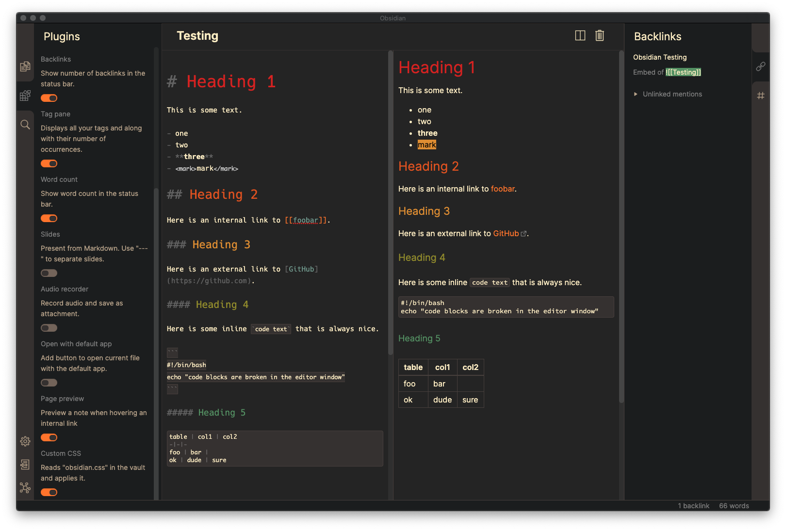
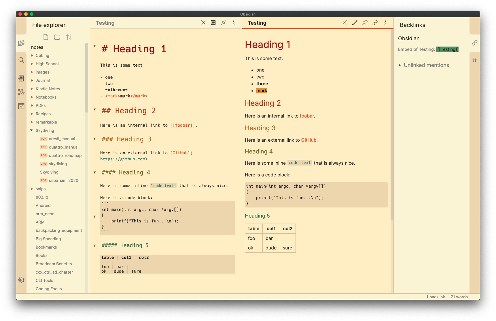

# Obsidian + gruvbox

This is a [gruvbox](https://github.com/morhetz/gruvbox) theme for
[Obsidian](https://obsidian.md). It supports both light and dark modes.

Simply copy the `obsidian.css` file to your vault directory and reload
Obsidian for it to take effect.

